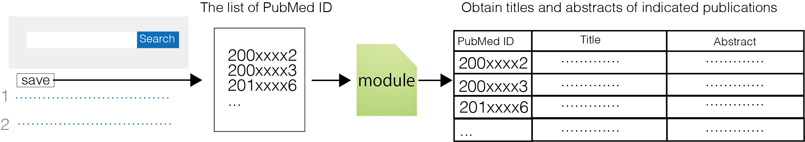

This repository contains the code and the dataset used for [our manuscript](https://www.jstage.jst.go.jp/article/bpb/47/11/47_b24-00319/_article/-char/en). Module 3.0 enables automated extraction of titles and abstracts of indicated articles by PubMed ID.
Web-based application of module 3.0 (Pubmed exporter) is available [here](https://pubmed-exporter.herokuapp.com/).

## Software requirements
- Python >=3.9.12
- Numpy >=1.23.5
- Pandas >=1.5.2
- beautifulsoup4 >=4.12.0
- urllib3 >=1.26.15
- matplotlib >= 3.6.2
- matplotlib-venn >= 0.11.9
- pillow >=9.3.0
- wordcloud >=1.8.2.2
- spacy >=3.4.4
- scikit-learn >=1.0.2

## Modules
- Module1.0 for producing Table1.
- Module2.0 for producing Table2 from Table1. Table3 (corresponding to Supplementary Table S1) was prepared by data cleaning of Table2.
- Module2.1 for producing Table4 (corresponding to Fig.2D) from Table3.
- Module2.2 for venn-diagram in Fig.2C.
- Module3.0 for retrieving PubMed records of the indicated publications.
- Module4.0 for word cloud analysis. WC1–4 (corresponding to Fig.3C) and WC5–8 (corresponding to Fig.3D) were prepared from Table11–14 and 15–18, respectively.
- Module5.0 for Latent Dirichlet allocation (LDA). Table7–10 were used for LDA, producing Table19–64. Table29 (topic = 20) was used for in Fig.4. Table41 includes perplexity of each topic (Supplementary Fig.S2).

## PubMed exporter
The ready to use web-based application for obtaining records comprising abstracts and titles of indicated publications.

